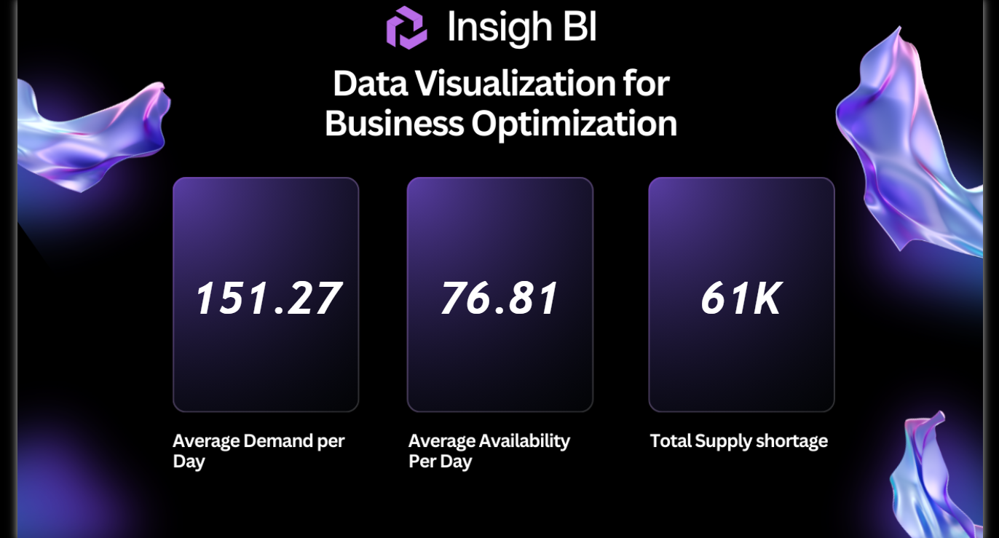

# 📊 Inventory Demand & Supply Optimization Dashboard

## 🚀 Project Overview
This project demonstrates an end-to-end data pipeline for inventory analysis using SQL Server, MySQL, and Power BI. It focuses on optimizing business decisions by analyzing demand, availability, and profitability.

---

## 🧠 Key Features
- Designed test and production environments for data validation  
- Performed data cleaning and transformation using SQL queries and joins  
- Built an ETL pipeline to create an analytical dataset  
- Migrated database from SQL Server to MySQL  
- Developed an interactive Power BI dashboard for business insights  

---

## 📊 Dashboard Insights
- Average Demand vs Availability  
- Total Supply Shortage  
- Total Profit and Loss Analysis  
- Identification of gaps between demand and supply  

---

## 🛠️ Tech Stack
- SQL Server  
- MySQL  
- Power BI  
- SQL (Joins, ETL, Data Cleaning)  

---

## 🔄 Workflow
1. Created test environment for initial data validation  
2. Performed data cleaning and transformations using SQL  
3. Moved validated data to production environment  
4. Fixed inconsistencies in production dataset  
5. Joined inventory and product tables to build analytical dataset  
6. Migrated SQL Server queries to MySQL  
7. Connected dataset to Power BI for visualization  

---

## 📂 Project Structure
```
Inventory-Analysis/
│
├── Datasets/
│   ├── Prod+Env+Inventory+Dataset.csv
│   ├── Test+Environment+Inventory+Dataset.csv
│   └── Products.csv
│
├── Images/
│   ├── dashboard1.png
│   └── dashboard2.png
│
├── Inventory Analysis.pbix
│
├── SQLQuery1.sql
│
├── README.md
```

---

## 📁 Dataset Details
- Prod+Env+Inventory+Dataset.csv → Production dataset used for final analysis  
- Test+Environment+Inventory+Dataset.csv → Test dataset used for validation and cleaning  
- Products.csv → Product information including product name and unit price  

---

## ▶️ How to Use

### 1. Setup Database
- Import CSV files into SQL Server or MySQL  
- Create required tables (Products, Inventory datasets)

### 2. Run SQL Script
- Open SQLQuery1.sql  
- Execute step-by-step:
  - Create test environment  
  - Perform data validation  
  - Clean production data  
  - Generate final analytical dataset  

### 3. Open Power BI Dashboard
- Open Inventory Analysis.pbix in Power BI Desktop  
- Connect to your SQL database (if needed)  
- Refresh data  

### 4. Explore Insights
- Analyze demand vs availability  
- Identify shortages and profit/loss  
- Use dashboard visuals for decision-making  

---

## 📊 Dashboard Preview



---

## 💡 Key Learnings
- Designed a real-world data pipeline using SQL  
- Handled data cleaning and validation in test and production environments  
- Built ETL workflows using SQL queries  
- Migrated queries across different database systems (SQL Server to MySQL)  
- Developed business-focused dashboards for decision-making  

---

## 🔗 Connect with Me
- LinkedIn: www.linkedin.com/in/mehtab-khan-mk  
- GitHub: https://github.com/Mehtab161
